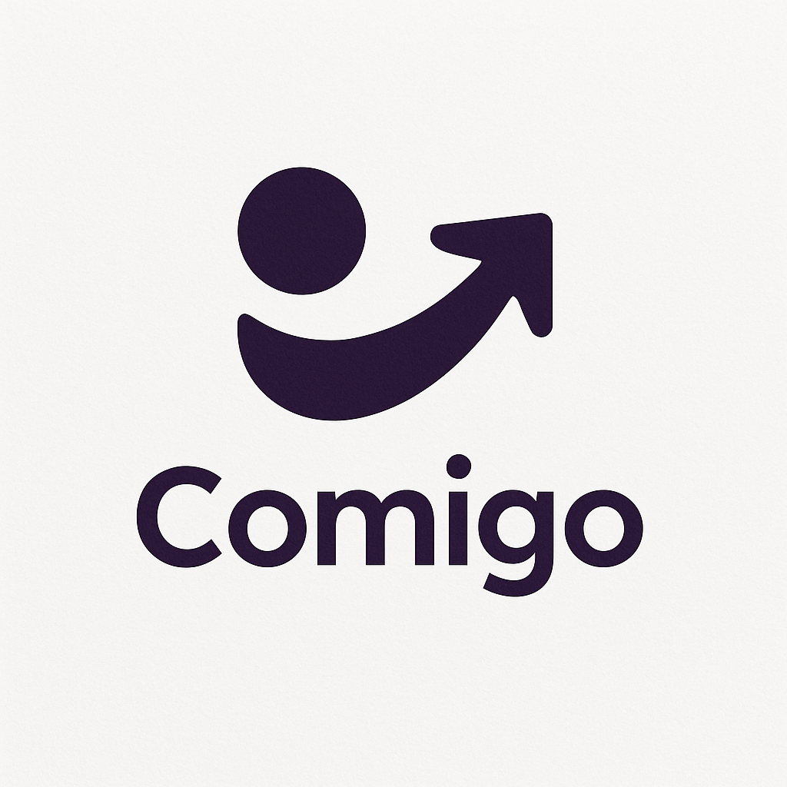

# Comigo 👜

Comigo is a modern, user-friendly app that helps you manage the items you don’t want to forget when leaving home. With ready-made lists, personal lists, and shared lists, you can organize your daily life more efficiently.

---

## Features ✨

- **Ready-Made Lists:** Choose from pre-made lists of essential items to take when leaving home.  
- **Create Your Own List:** Make fully personalized lists according to your needs.  
- **Shared Lists:** Share lists with friends or family and update them in real-time.  
- **Instant Check-Offs:** Mark items as taken and see at a glance what’s completed.  
- **User-Friendly Interface:** Simple and modern design for quick and easy use.  

---

## Screenshots 🖼️

  
*List selection screen*  

  
*Real-time tracking with a shared list*  

  
*Feature to cross off taken items*  
